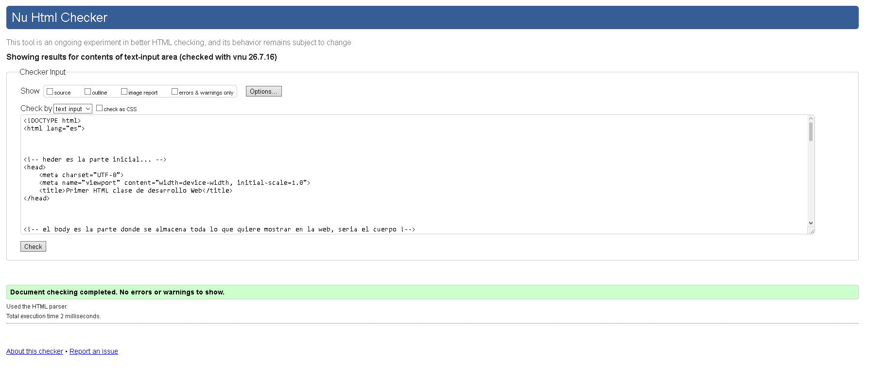

Tienda web primer poryecto HTML

## Nombre del estudiante
Mario Fernando Cerna Najera

## Carné
0905-23-5025

## Nombre del proyecto
Proyecto Integrador HTML5

## Descripción
Este proyecto es una pequeña parte de una estructura para una tienda web, como ejemplo para la primera tarea 
## Validación W3C

